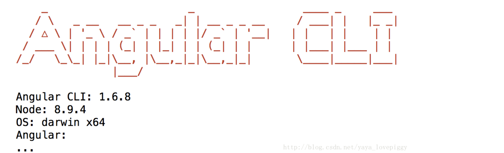

# 1.11 Angular-CLI Installation

* Run code below to install Angular-cli \(use homebrew\):

```bash
npm install -g @angular/cli
```

* If it succeed, then it will show the figure like below:



* If not, like showing `ng: command not found`, then we should follow following steps to delete all of them and then install again:
* Delete npm and node:
  * `npm config get prefix`
  * `cd [path we got just now]`
  * `cd lib && rm -rf node_modules`
  * `cd /usr/local/lib && sudo rm -rf node*`
  * `cd /usr/local/include & sudo rm -rf node*`
  * `brew uninstall node (if node was installed by brew)`
  * `cd /usr/local/bin`
  * `sudo rm -rf npm`
  * `sudo rm -rf node`
  * `sudo rm -rf /usr/local/share/man/man1/node.1`
  * `sudo rm -rf /usr/local/lib/dtrace/node.d`
  * `sudo rm -rf ~/.npm`


