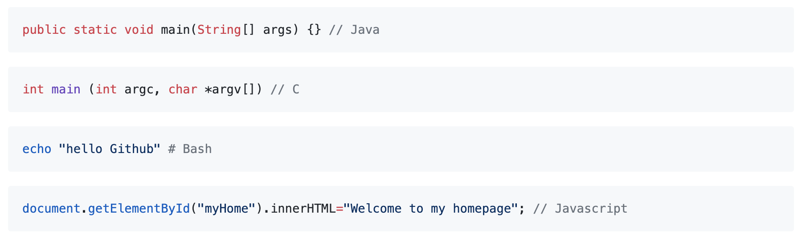

# 8.1 README & Markdown

.md后缀是markdown的缩写，markdown是一种编辑博客的语言。Github在标准md语言上做了些修改，成为了Github Flavored Markdown，简称GFM

## 1. Title

### a. 等级表示法

注意\#和title之间有空格

```text
# 一级标题
## 二级标题
### 三级标题
#### 四级标题
##### 五级标题
###### 六级标题
```


## 2. Content

### a. 换行 &lt;br&gt;

这里注意，在符号前面加上反斜杠 \ 就可以转义之后的符号内容

```text
这是一段普通的文本，
直接回车不能换行，<br>
要使用\<br>
```


### b. 文字高亮 \` \`

```text
Thank `You`. Please `Call` Me `Coder`
```


### c. 超链接

超链接的格式：\[要显示的文字\]\(链接地址\)

```text
[Google Web](www.google.com)
```


同时也可以添加悬停效果：\[要显示的文字\]\(链接地址 “悬停显示“\)

```text
[Google Web](www.google.com "This is Google Web Page!")
```


### d. 原点符号 \*

```text
* first line
* Second line
* Third line
    * number one
    * number two
        * Letter a
```


### e. 缩进 &gt;

```text
>数据结构  
>>树  
>>>二叉树  
>>>>平衡二叉树  
>>>>>满二叉树 
```


### f. 图片

若是网络图片

```text
  
```

为了引用Github仓库里的图片

```text

```

如果想给图片加上超链接，例如

```text
[![baidu]](http://baidu.com)  
[baidu]:http://www.baidu.com/img/bdlogo.gif "百度Logo"
```

### g. 代码片段 \`\`\`

```text
```Java
public static void main(String[] args) {} // Java
```
```C
int main (int argc, char *argv[]) // C
```
```Bash
echo "hello Github" # Bash
```
```javascript
document.getElementById("myHome").innerHTML="Welcome to my homepage"; // Javascript
```
```



## 3. Badge

常用的自定义徽标格式：

```text
https://img.shields.io/badge/{徽标标题}-{徽标内容}-{徽标颜色}.svg
```

放在Github的README.md中时需要转化为MarkDown语法：

```text

```

此处给出两个链接，一个是说明文档：



一个是Github的官方徽标说明文档：




