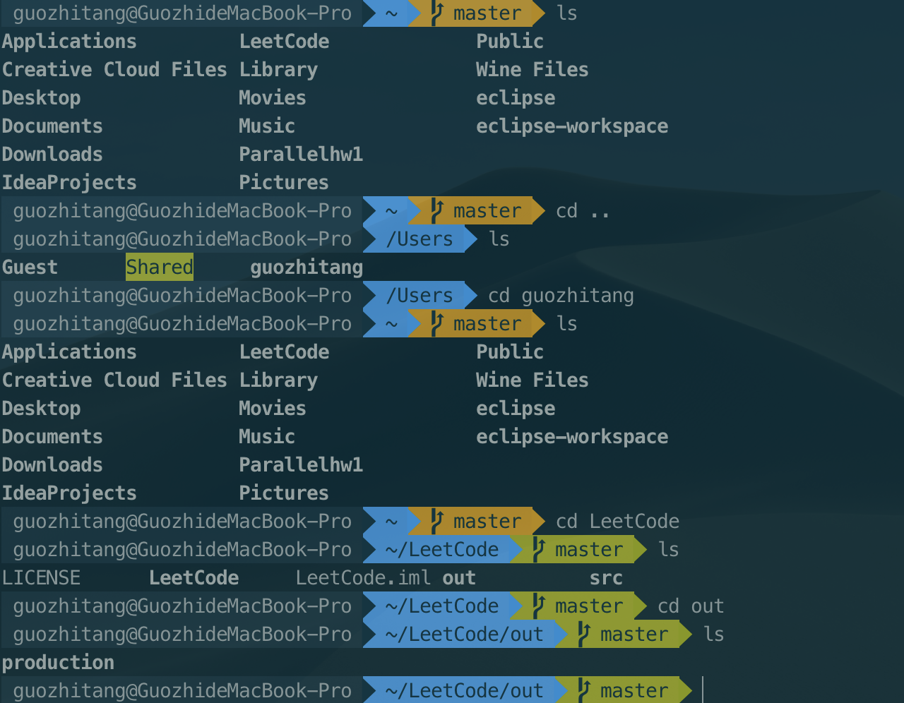
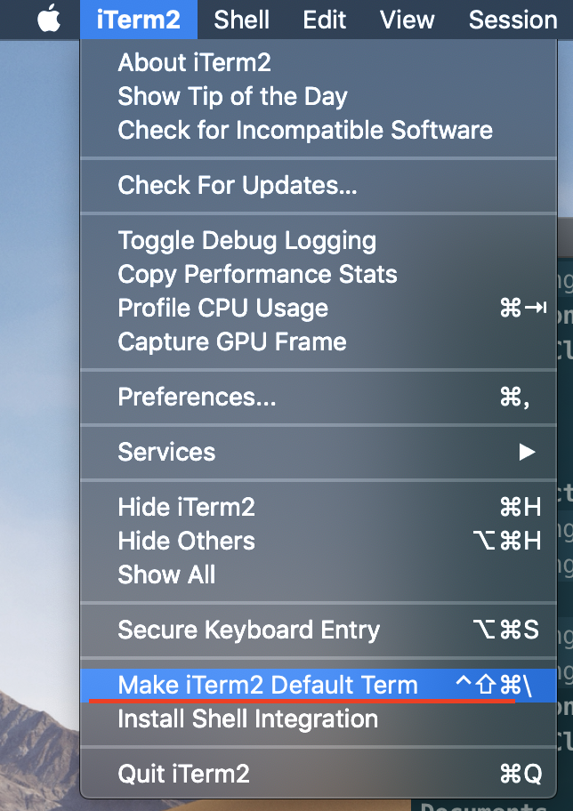
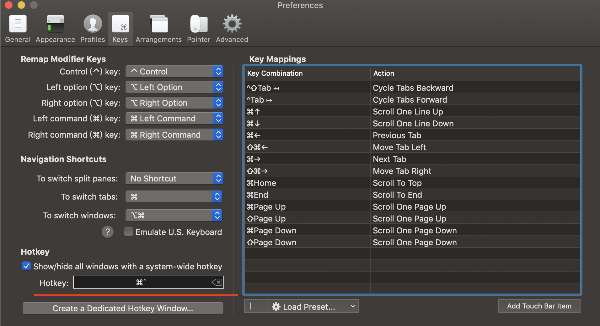
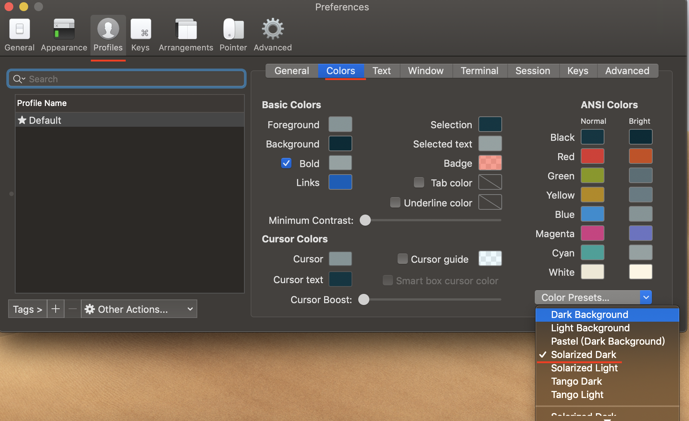
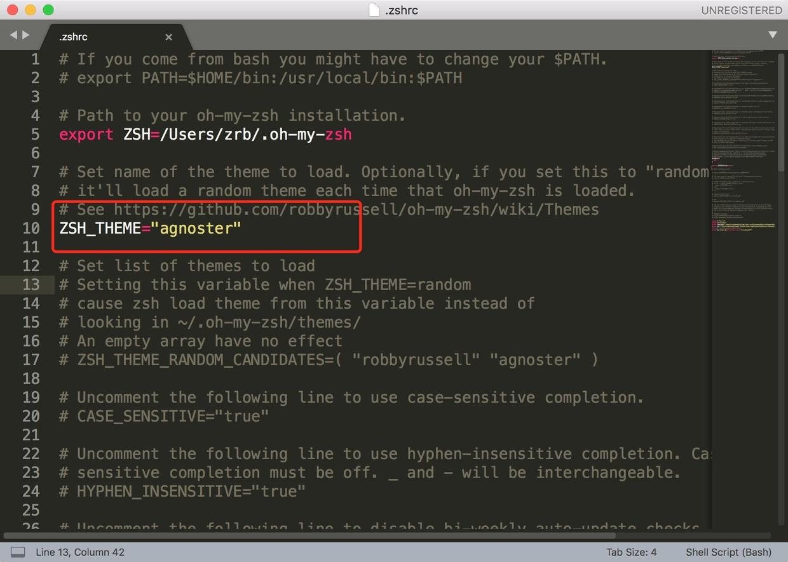
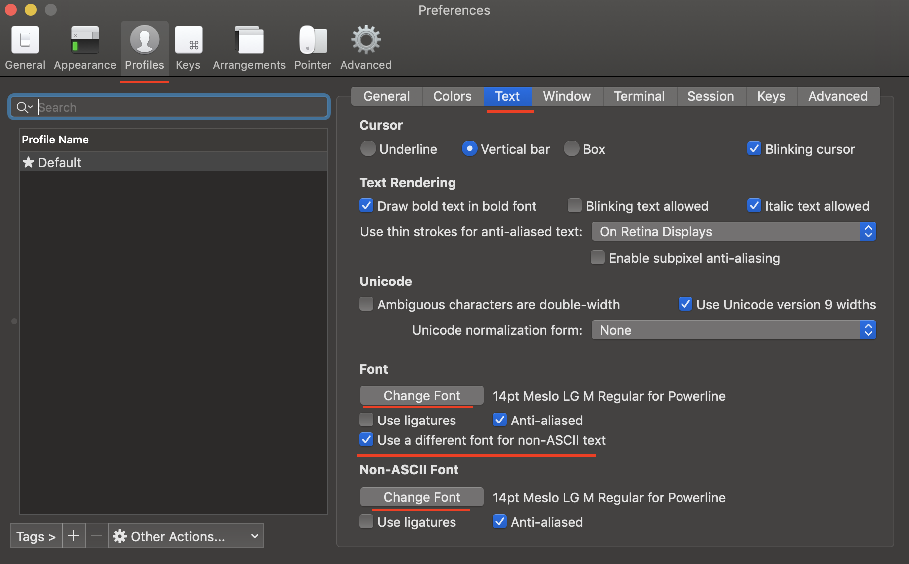
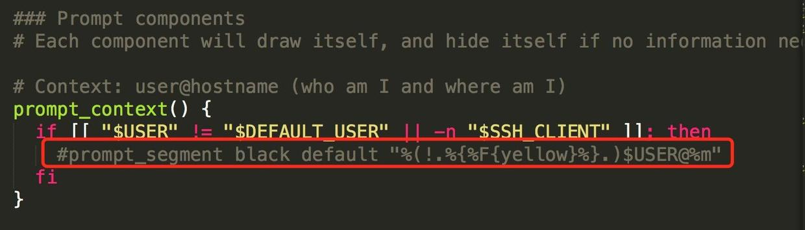
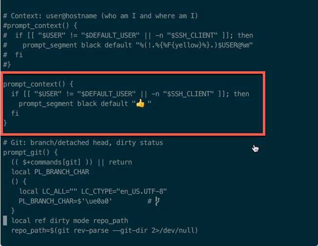

# 1.4 iTerm2 Settings

## 1. Introduction

效果如下：



 拥有语法高亮，命令行tab补全，自动提示符，显示Git仓库状态等功能

## 2. Installation



直接上面的官网地址下载即可

## 3. Configuration

 将iTem2设置为默认终端：

 （菜单栏）iTerm2 -&gt; Make iTerm2 Default Term



 然后打开偏好设置preference，选中Keys，勾选Hotkey下的Show/hide iTerm2 with a system-wide hotkey，将热键设置为command + \` ，这样就可以通过command + \` 全局热键来打开或关闭iTerm2窗口



## 4. Color Settings

 选用 [solarized](http://ethanschoonover.com/solarized)，下载解压， 点击目录`solarized\iterm2-colors-solarized`的`Solarized Dark.itermcolors`和 `Solarized Light.itermcolors`进行安装



## 5. Install oh-my-zsh

 通过命令行安装：

```bash
curl -L https://github.com/robbyrussell/oh-my-zsh/raw/master/tools/install.sh | sh
```

 卸载oh-my-zsh命令：

```bash
uninstall_oh_my_zsh
```

安装成功后如下图所示：


## 6. Install "agnoster" Theme

 用 vim 编辑隐藏文件 .zshrc， 终端输入：

```bash
vim ~/.zshrc    //进入.zshrc文件，将ZSH_THEME后面字段改为agnoster
```

 将zsh主题修改为“agnoster”：



## 7. Configure Font

### 7.1 Configure Meslo Font

#### 7.1.1 Method 1:

 可以直接复制下面命令到终端中安装：

```bash
# clone
git clone https://github.com/powerline/fonts.git --depth=1
# install
cd fonts
./install.sh
# clean-up a bit
cd ..
rm -rf fonts
```

#### 7.1.2 Method 2:

*  使用 [Meslo](https://github.com/powerline/fonts/blob/master/Meslo%20Slashed/Meslo%20LG%20M%20Regular%20for%20Powerline.ttf) 字体，点开链接点击 view raw 下载字体
*  安装字体到系统字体册
*  在iTerm2中应用字体 iTerm -&gt; Preferences -&gt; Profiles -&gt; Text -&gt; Change Font



### 7.2 Configure Monaco Powerline Font

```bash
git clone https://github.com/powerline/fonts.git
```

 进入fonts目录

```bash
cd fonts
./install.sh
```

 删除fonts目录

```bash
cd ..
rm -rf fonts
```

## 8. Syntax Highlighting

 直接使用homebrew安装zsh-syntax-highlighting插件

```bash
brew install zsh-syntax-highlighting
```

Configure .zshrc file, insert one row

```bash
source /xxx/zsh-syntax-highlighting/zsh-syntax-highlighting.zsh
//(注意： /xxx/ 代表.zshrc所在的路径)
```

加载 .zshrc 配置

```bash
source ~/.zshrc
```

## 9. Hide User-name

 一般终端每一行前都会有`xxx@xxxdeMacbook-Pro:`我们可以将其隐藏掉。  
进入oh-my-zsh的agnoster主题，编辑agnoster.zsh-theme文件

```bash
vim ~/.oh-my-zsh/themes/agnoster.zsh-theme
```



## 10. Automatic Command Hint

 当我们输入命令时，终端会自动提示你接下来可能要输入的命令，这时按 → 便可输出这些命令，非常方便


有些版本已经内置自动提示命令的功能了


 克隆仓库到本地 ~/.oh-my-zsh/custom/plugins 路径下

```bash
git clone git://github.com/zsh-users/zsh-autosuggestions $ZSH_CUSTOM/plugins/zsh-autosuggestions
```

 用 vim 打开 .zshrc 文件，找到插件设置命令，默认是 plugins=\(git\) ，我们把它修改为

```bash
plugins=(zsh-autosuggestions git)
```

 重新打开终端窗口


 PS：当你重新打开终端的时候可能看不到变化，可能你的字体颜色太淡了，我们把其改亮一些：


```bash
cd ~/.oh-my-zsh/custom/plugins/zsh-autosuggestions 
```

```bash
vim zsh-autosuggestions.zsh
```

 修改 ZSH\_AUTOSUGGEST\_HIGHLIGHT\_STYLE='fg=10' （ fg的值根据电脑情况改变）

## 11. ls Problem

 Mac OS X 是基于 FreeBSD 的，所以一些工具 ls, top 等都是 BSD 那一套，ls 不是 GNU ls，所以即使 Terminal/iTerm2 配置了颜色，但是在 Mac 上敲入 ls 命令也不会显示高亮，可以通过安装 coreutils 解决

```bash
brew install coreutils
```

## 12. 👍 Configuration

 进入主题目录

```bash
cd ~/.oh-my-zsh/themes
```

 打开**agnoster**主题,按红框里面的编辑保存完退出就好了

```bash
vim agnoster.zsh-theme
```



