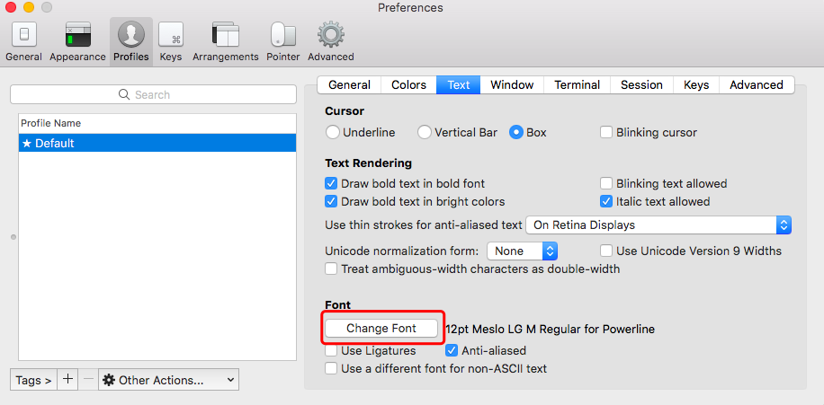

# 1.4 iTerm2 Settings

## 1. Introduction：

效果如下：


 拥有语法高亮，命令行tab补全，自动提示符，显示Git仓库状态等功能

## 2. Installation:



直接上面的官网地址下载即可

## 3. Configuration:

 将iTem2设置为默认终端：

 （菜单栏）iTerm2 -&gt; Make iTerm2 Default Term


 然后打开偏好设置preference，选中Keys，勾选Hotkey下的Show/hide iTerm2 with a system-wide hotkey，将热键设置为command + \` ，这样就可以通过command + \` 全局热键来打开或关闭iTerm2窗口


## 4. Color Settings:

 选用 [solarized](http://ethanschoonover.com/solarized)，下载解压， 点击目录`solarized\iterm2-colors-solarized`的`Solarized Dark.itermcolors`和 `Solarized Light.itermcolors`进行安装


## 5. Install oh-my-zsh

 通过命令行安装：

```text
curl -L https://github.com/robbyrussell/oh-my-zsh/raw/master/tools/install.sh | sh
```

 卸载oh-my-zsh命令：

```text
uninstall_oh_my_zsh
```

安装成功后如下图所示：


## 6. Install "agnoster" Theme:

 用 vim 编辑隐藏文件 .zshrc， 终端输入：

```text
vim ~/.zshrc    //进入.zshrc文件，将ZSH_THEME后面字段改为agnoster
```

 将zsh主题修改为“agnoster”：


## 7. Configure Font:

### 7.1 Configure Meslo Font:

#### 7.1.1 Method 1:

 可以直接复制下面命令到终端中安装：

```text
# clone
git clone https://github.com/powerline/fonts.git --depth=1
# install
cd fonts
./install.sh
# clean-up a bit
cd ..
rm -rf fonts
```

#### 7.1.2 Method 2:

*  使用 [Meslo](https://github.com/powerline/fonts/blob/master/Meslo%20Slashed/Meslo%20LG%20M%20Regular%20for%20Powerline.ttf) 字体，点开链接点击 view raw 下载字体
*  安装字体到系统字体册
*  在iTerm2中应用字体 iTerm -&gt; Preferences -&gt; Profiles -&gt; Text -&gt; Change Font



### 7.2 Configure Monaco Powerline Font:

```text
git clone https://github.com/powerline/fonts.git
```

 进入fonts目录

```text
cd fonts
./install.sh
```

 删除fonts目录

```text
cd ..
rm -rf fonts
```

## 8. Syntax Highlighting:


