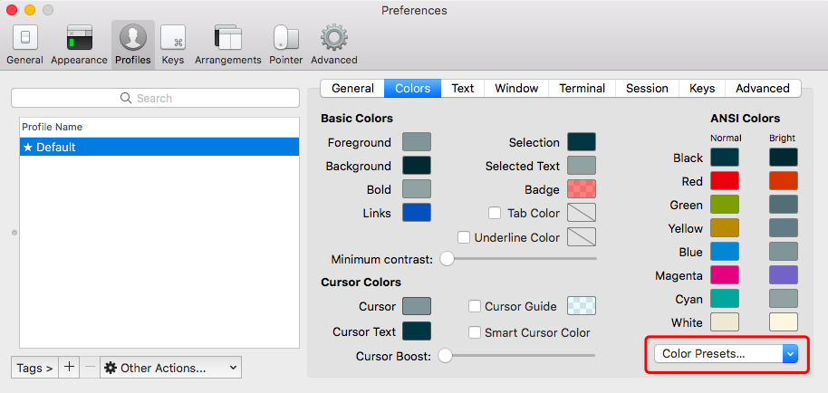

# 1.4 iTerm2 Settings

## 1. Introduction：

效果如下：


 拥有语法高亮，命令行tab补全，自动提示符，显示Git仓库状态等功能

## 2. Installation:



直接上面的官网地址下载即可

## 3. Configuration:

 将iTem2设置为默认终端：

 （菜单栏）iTerm2 -&gt; Make iTerm2 Default Term


 然后打开偏好设置preference，选中Keys，勾选Hotkey下的Show/hide iTerm2 with a system-wide hotkey，将热键设置为command + \` ，这样就可以通过command + \` 全局热键来打开或关闭iTerm2窗口


## 4. Color Settings:

 选用 [solarized](http://ethanschoonover.com/solarized)，下载解压， 点击目录`solarized\iterm2-colors-solarized`的`Solarized Dark.itermcolors`和 `Solarized Light.itermcolors`进行安装



## 5. Install oh-my-zsh

 通过命令行安装：

```text
curl -L https://github.com/robbyrussell/oh-my-zsh/raw/master/tools/install.sh | sh
```

 卸载oh-my-zsh命令：

```text
uninstall_oh_my_zsh
```

安装成功后如下图所示：


## 6. 

