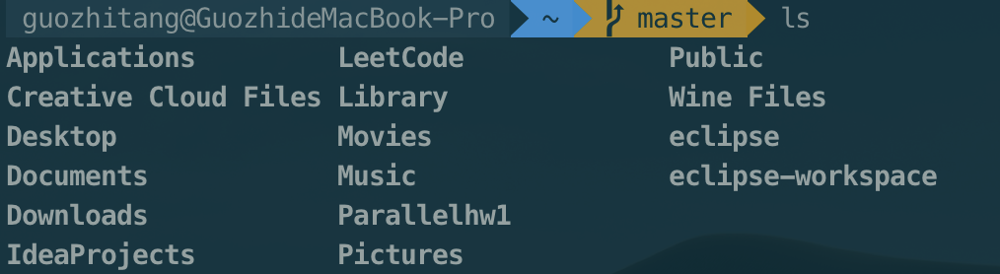
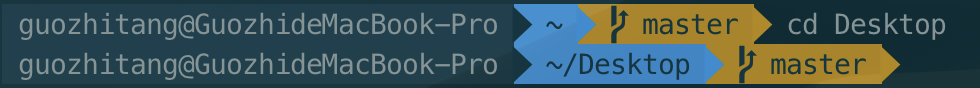
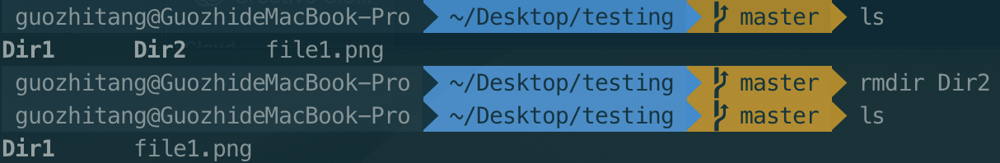

# 4.2 Linux Commands

## 1. ls -- List

 ls会列举出当前工作目录的内容（文件或文件夹）。

## 2. mkdir -- Make Directory

 mkdir 用于新建一个新目录。

## 3. pwd -- Change Directory

 显示当前工作目录。

## 4. cd -- Change Directory

 切换文件路径，cd 将给定的文件夹（或目录）设置成当前工作目录。

## 5. rmdir -- Remove Directory

删除给定的目录。

## 6. rm -- Remove

 rm 会删除给定的文件。

## 7. cp -- Copy

 cp 命令对文件进行复制。

## 8. mv -- Move

 mv 命令对文件或文件夹进行移动，如果文件或文件夹存在于当前工作目录，还可以对文件或文件夹进行重命名。

## 9. cat -- Concatenate and Print Files

 cat 用于在标准输出（监控器或屏幕）上查看文件内容。

## 10. tail -- Print TAIL\(from last\)

 ail 默认在标准输出上显示给定文件的最后10行内容，可以使用tail -n N 指定在标准输出上显示文件的最后N行内容。

## 11. less -- Print LESS

 less 按页或按窗口打印文件内容。在查看包含大量文本数据的大文件时是非常有用和高效的。你可以使用Ctrl+F向前翻页，Ctrl+B向后翻页。

## 12. grep

 grep 在给定的文件中搜寻指定的字符串。

* grep -i “” 在搜寻时会忽略字符串的大小写
* grep -r “” 则会在当前工作目录的文件中递归搜寻指定的字符串

## 13. find

 这个命令会在给定位置搜寻与条件匹配的文件。

* find -name 的-name选项来进行区分大小写的搜寻
* find -iname 来进行不区分大小写的搜寻

## 14. tar

tar命令能创建、查看和提取tar压缩文件。

* tar -cvf 是创建对应压缩文件
* tar -tvf 来查看对应压缩文件
* tar -xvf 来提取对应压缩文件

## 15. gzip

*  gzip 命令创建和提取gzip压缩文件
*  gzip -d 来提取压缩文件

## 16. unzip

* unzip 对gzip文档进行解压
* unzip -l 命令查看文件内容

## 17. help

 help会在终端列出所有可用的命令,可以使用任何命令的-h或-help选项来查看该命令的具体用法。图就省略啦，会有详细列表显示出来的。

## 18. whatis -- What is this command

 whatis 会用单行来描述给定的命令，就是解释当前命令。

## 19. exit

 exit用于结束当前的终端会话。

## 20. ping

 ping 通过发送数据包ping远程主机\(服务器\)，常用与检测网络连接和服务器状态。

## 21.who -- Switch User

 who能列出当前登录的用户名。

## 22. su -- Switch User

 su 用于切换不同的用户。即使没有使用密码，超级用户也能切换到其它用户。

## 23. sudo -- Administrator Authority

 Linux sudo命令以系统管理者的身份执行指令，也就是说，经由 sudo 所执行的指令就好像是 root 亲自执行。

## 24. uname

 uname会显示出关于系统的重要信息，如内核名称、主机名、内核版本、处理机类型等等，使用uname -a可以查看所有信息。

## 25. df -- Disk space Free

 df查看文件系统中磁盘的使用情况–硬盘已用和可用的存储空间以及其它存储设备。你可以使用df -h将结果以人类可读的方式显示。

## 26. ps -- ProcessS

 ps显示系统的运行进程

## 27. top -- Top Processes

 top命令会默认按照CPU的占用情况，显示占用量较大的进程,可以使用top -u 查看某个用户的CPU使用排名情况。

## 28. shutdown

 shutdown用于关闭计算机，而shutdown -r用于重启计算机。

