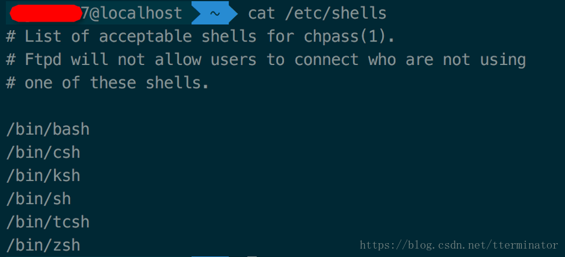

# 4.1 zsh Exchange

## 1. 查看系统Shell

 zsh是脚本的一种，支持标准的shell，和bash相比有强大的自动补全、错误提示等功能

mac中默认是已经安装了zsh的，只是默认没有使用。查看系统中有没有安装zsh，可以执行如下命令：

```text
cat /etc/shells
```



## 2. 切换使用zsh

```text
chsh -s /bin/zsh
```

 如果你哪一天又想用bash了，也可以使用下列命令：

```text
chsh -s /bin/bash
```

 切换成功后，退出，再次进入的时候就切换为bash了

