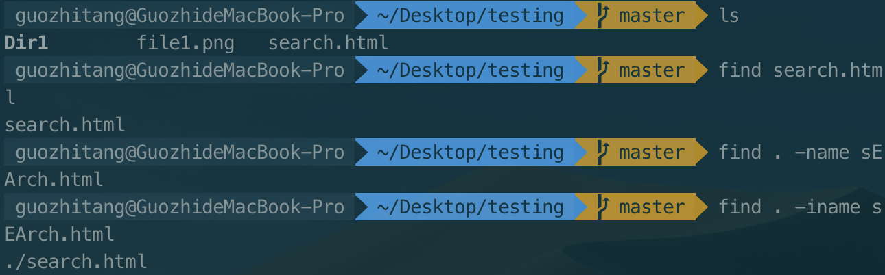
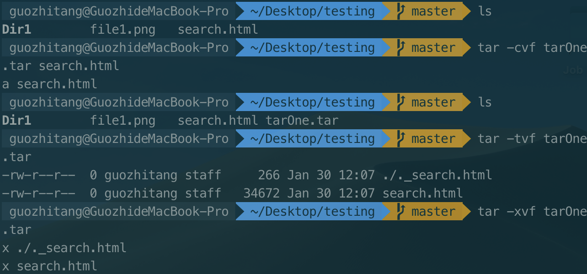
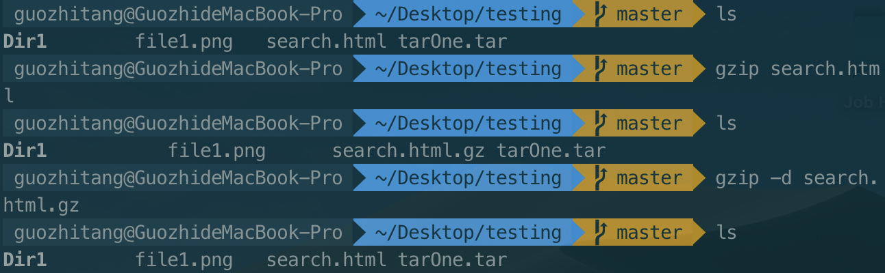
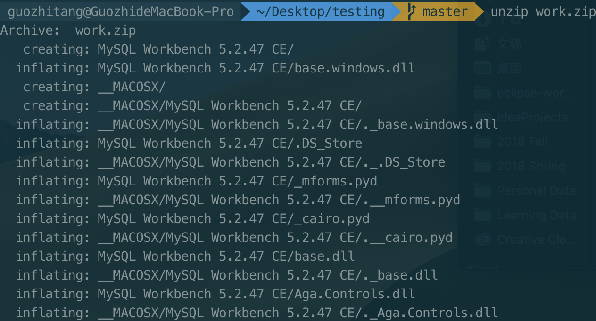

# 4.2 Linux Commands

## 1. ls -- List

 ls会列举出当前工作目录的内容（文件或文件夹）。

## 2. mkdir -- Make Directory

## 3. pwd -- Change Directory

## 4. cd -- Change Directory

## 5. rmdir -- Remove Directory

## 6. rm -- Remove

## 7. cp -- Copy

## 8. mv -- Move

## 9. cat -- Concatenate and Print Files

## 10. tail -- Print TAIL\(from last\)

## 11. less -- Print LESS

## 12. grep

## 13. find

## 14. tar

## 15. gzip

## 16. unzip

## 17. help

## 18. whatis -- What is this command

## 19. exit

## 20. ping

## 21.who -- Switch User

## 22. su -- Switch User

## 23. uname

## 24. df -- Disk space Free

## 25. ps -- ProcessS

## 26. top -- Top processess

## 27. shutdown

